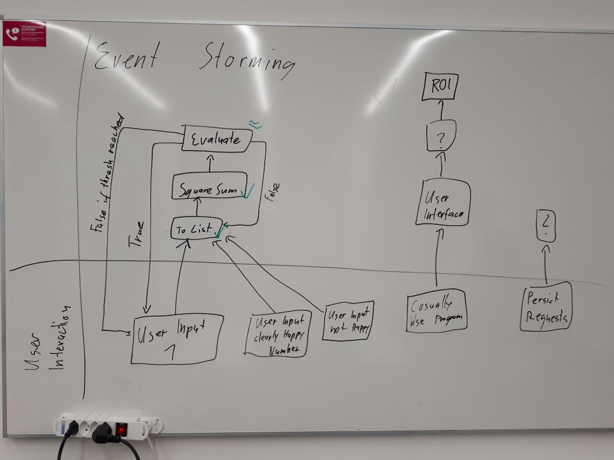

| Travis CI | Appveyor | sonarcloud
| :-------- | :------- | :---------
| | | 
 | 

# happy number dojo

In the context of the module SW-Architecture (swat) at hslu, 4 students ([@binerdy](https://github.com/binerdy), [@cyrilleulmi](https://github.com/cyrilleulmi), [@PascalStalder](https://github.com/PascalStalder), [@wtjerry](https://github.com/wtjerry) have found themselfs to have a common goal: To become better SW craftsmen.
We thought what better way is there to learn from each other than by programming together. And so we set out to start solving this dojo.

Our focus points are:
- TDD
- seeing different coding styles
- learning new keyboard shortcuts

## game rules
see: http://ccd-school.de/en/coding-dojo/function-katas/happy-numbers/

## event storming

during the dojo we realized everyone has a different goal and want's to go in his own direction. To clarify our goal and to lead us all into the same direction, we conducted an event storming session.

